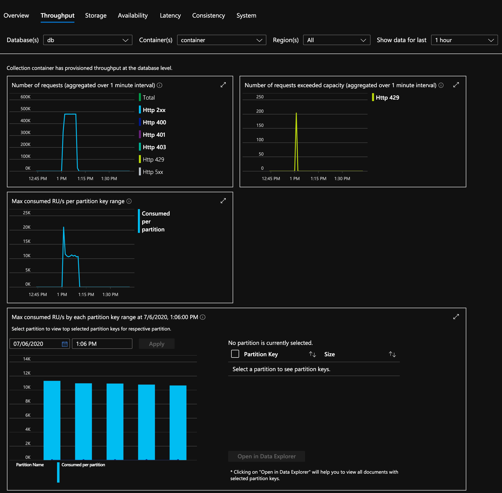

<!-- markdownlint-disable MD029 -->

# Event Hub to Cosmos

The goal of this solution was to prove that 4.2 million records in Event Hubs could be dispatched to Cosmos in under 30 minutes.

There are 2 projects:

* producer - This project pushs the records into Event Hubs.

* consumer - This project reads the records from Event Hubs and pushes them into Cosmos.

These projects are written as dotnet console applications that use the latest versions of the SDKs for Event Hubs and Cosmos. At the time of this writing, that meant using EventProcessorClient for Event Hubs and the AllowBulkExecution flag for Cosmos. Using the EventProcessorClient requires a Storage Account for recording

The solutions were hosted in Azure Kubernetes Service (AKS). The deploy.yaml files in each project include a deployment for 8 containers of each.

## Running a Test

1. Configure the deploy.yaml file for the producer to inject the desired number of results. For instance, "replicas: 8", "EVENTHUB_BATCHSIZE: 100", and "EVENTHUB_COUNT: 5250" yields 4.2m records (8 x 100 x 5250). This is 8 producers, each running 5250 batches of 100 records each.

    You will also need a valid connection string for the Event Hub.

2. Deploy the producer Pod to AKS.

3. Monitor the progress using "kubectl logs". The last record in each replica will look something like this:

```bash
525000 successes, 0 failures, after 243.1630497 seconds, done.
```

4. Delete the producer Pod or scale to 0 replicas.

5. Configure the deploy.yaml file for the consumer. For instance, "replicas: 8" and "EVENTHUB_RATELIMIT: 1000" means that 8,000 records will be processed per second (for 4.2m records, that means consumption in about 9 minutes).

    You will also need valid connection strings for the Event Hub, Cosmos database, and Storage Account.

6. Monitor the progress using "kubectl logs". The process does not stop looking for messages, so you should just look for the number of successes staying consistent over a period of reports and a backlog of 0. For instance, in the following, you can see that 525,194 records finished after 526 seconds.

```bash
525194 successes, 0 failures, 0 retries after 525.6954685 seconds, avg RU cost is 6, backlog is 0.
525194 successes, 0 failures, 0 retries after 530.6948895 seconds, avg RU cost is 6, backlog is 0.
525194 successes, 0 failures, 0 retries after 535.6951557 seconds, avg RU cost is 6, backlog is 0.
525194 successes, 0 failures, 0 retries after 540.6954888 seconds, avg RU cost is 6, backlog is 0.
```

## Environment Variables

The producer has the following environment variable options...

* EVENTHUB_CONNSTRING: [REQUIRED] The connection string for the Event Hub namespace.

* EVENTHUB_NAME: [REQUIRED] The name of the Event Hub.

* EVENTHUB_BATCHSIZE: [DEFAULT: 100] You may specify the number of messages in a batch.

* EVENTHUB_COUNT: [DEFAULT: 100] You may specify the number of batches to run.

The consumer has the following environment variable options...

* EVENTHUB_CONNSTRING: [REQUIRED] The connection string for the Event Hub namespace.

* EVENTHUB_NAME: [REQUIRED] The name of the Event Hub.

* EVENTHUB_CONSUMERGROUP: [DEFAULT: $Default] You may specify the name of the consumer group for Event Hub.

* EVENTHUB_RATELIMIT: [DEFAULT: 0] If you specify a number greater than 0, messages will be pulled from the Event Hub at that rate per second. For example, if you specify 1000, then 1000 messages per second will be read from Event Hub.

* BLOB_CONNSTRING: [REQUIRED] The connection string for the Azure Storage Account that will hold checkpoint information.

* BLOB_CONTAINER: [REQUIRED] The name of the container in the Azure Storage Account that will hold checkpoint information.

* COSMOS_CONNSTRING: [REQUIRED] The connection string for the Cosmos account.

* COSMOS_DATABASE: [REQUIRED] The database in Cosmos where data will be written.

* COSMOS_CONTAINER:  [REQUIRED] The container in the Cosmos database where data will be written.

You can optionally specify these parameters in a ".env" file in the folder where you execute the application from. The format is one variable per line with the variable name then equal sign followed by the value. This is most useful for local debugging as most production environments already have a system for managing environment variables.

## Index Policy

You can reduce the RU cost of a record write significantly by specifying an index policy that only computes indexes that you intend to use. For instance, the testing was done with only the "key" and "id" (always indexed) indexed.

```json
{
    "indexingMode": "consistent",
    "automatic": true,
    "includedPaths": [
        {
            "path": "/key/?"
        }
    ],
    "excludedPaths": [
        {
            "path": "/*"
        },
        {
            "path": "/\"_etag\"/?"
        }
    ]
}
```

## Success @ 50k RUs

Here is the final line from each of the 8 replicas (EVENTHUB_RATELIMIT = 1000) using 50k RUs...

```bash
526100 successes, 0 failures, 0 retries after 530.1189599 seconds, avg RU cost is 6, backlog is 0.
525100 successes, 0 failures, 19 retries after 530.7062604 seconds, avg RU cost is 6, backlog is 0.
525200 successes, 0 failures, 77 retries after 525.3218777 seconds, avg RU cost is 6, backlog is 0.
525200 successes, 0 failures, 85 retries after 530.4527766 seconds, avg RU cost is 6, backlog is 0.
523900 successes, 0 failures, 0 retries after 526.1200799 seconds, avg RU cost is 6, backlog is 0.
524700 successes, 0 failures, 0 retries after 530.479367 seconds, avg RU cost is 6, backlog is 0.
525900 successes, 0 failures, 53 retries after 530.8751562 seconds, avg RU cost is 6, backlog is 0.
523900 successes, 0 failures, 47 retries after 525.4076591 seconds, avg RU cost is 6, backlog is 0.
```

The total number of successes adds up to 4.2 million records completed in under 531 seconds (less than 9 minutes). The theoretical maximum performance would have been 504 seconds (4.2m records x 6 RU / 50k RU), so we came in just under that by limiting to 1000 requests per second.

From the metrics, we can see that we sustained just above 10k RU per second per physical partition and the spike only led to a couple hundred 429s (which were retried). This is exactly what you hope to see.



## Success @ 150k RUs

To prove that this approach and Cosmos can scale horizontally, here is a test with replicas (EVENTHUB_RATELIMIT = 3000) using 150k RUs...

```bash
525300 successes, 0 failures, 0 retries after 180.2665256 seconds, avg RU cost is 6, backlog is 0.
524600 successes, 0 failures, 0 retries after 180.3386372 seconds, avg RU cost is 6, backlog is 0.
525600 successes, 0 failures, 0 retries after 180.306657 seconds, avg RU cost is 6, backlog is 0.
524300 successes, 0 failures, 0 retries after 180.0646455 seconds, avg RU cost is 6, backlog is 0.
525600 successes, 0 failures, 0 retries after 180.2954361 seconds, avg RU cost is 6, backlog is 0.
525500 successes, 0 failures, 0 retries after 180.0513568 seconds, avg RU cost is 6, backlog is 0.
524800 successes, 0 failures, 0 retries after 179.9878807 seconds, avg RU cost is 6, backlog is 0.
524300 successes, 0 failures, 0 retries after 180.2795363 seconds, avg RU cost is 6, backlog is 0.
```

The total number of successes adds up to 4.2 million records completed in 180 seconds (3 minutes). In this case, there were 15 physical partitions with 10k RU each.

## Failure

It is easily possible to overflow the number of records that Cosmos can handle per second, so you will need to do some tests to make sure you keep the number of requests per second below the maximum. If you are driving it too hard, there will be 2 points of evidence.

In the logs, you will see an retries exceeding your successes and you will see a quickly growing backlog. The backlog will increase until it reaches ALLOW_BACKLOG_OF (default = 320k), at which point the container will crash.

```bash
29656 successes, 0 failures, 208732 retries after 55.7480003 seconds, avg RU cost is 14, backlog is 42766.
32458 successes, 0 failures, 235589 retries after 60.856983 seconds, avg RU cost is 14, backlog is 45488.
35119 successes, 0 failures, 260007 retries after 65.9869793 seconds, avg RU cost is 14, backlog is 48244.
```

The second point of evidence can be seen in the Throughput section of the Cosmos metrics. You will see a large number of 429s and a max consumed RU/s that exceeds the maximum number of RUs per physical partition. For instance, if you have 50k RUs provisioned and 5 physical partitions, then the max consumed RUs must stay below 10k.


